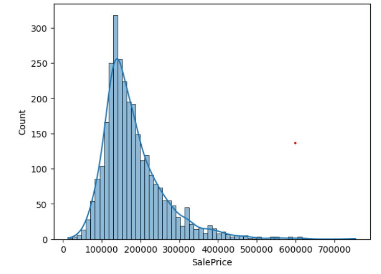
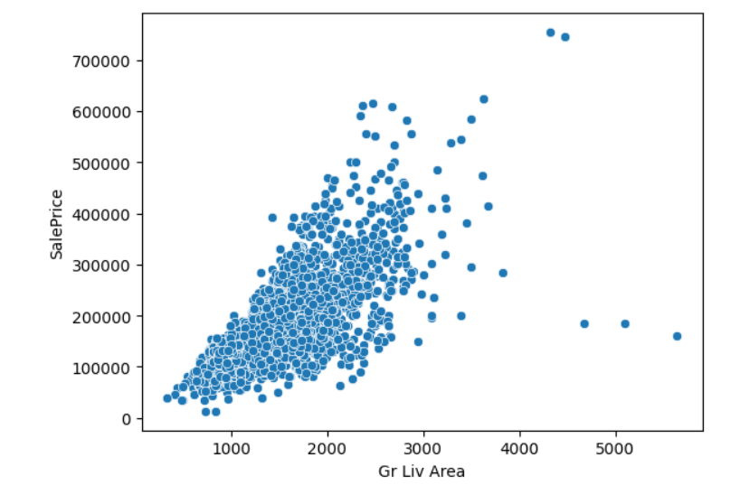
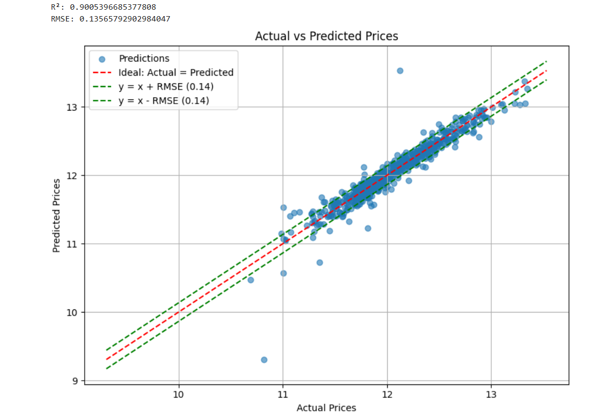

# 🏠 Ames Housing Price Prediction

This project uses **data cleaning** and **linear regression** techniques in python to predict house prices in Ames, Iowa, based on a dataset from Kaggle.

---

## 📁 Dataset

- **Source**: [Kaggle - House Prices: Advanced Regression Techniques](https://www.kaggle.com/competitions/house-prices-advanced-regression-techniques/data)
- **Target variable**: `SalePrice` (USD)
- **Features**: 80 explanatory (categorical + numerical) variables (excludes PID and Order #) 

---

## 🛠️ Tech Stack

- **Language**: Python3
- **Environment**: Jupyter Notebook or Virtual Environment (dependency list with versions included in dependencies.txt)

---

## 🧪 Workflow

### 1. **Data Preprocessing**
- Handle missing values
- Encode categorical features (One-Hot Encoding, Ordinal Mapping)
- Normalize/scale numerical features

### 2. **Exploratory Data Analysis**
- Below is the visualization of the distribution of sale prices of houses in Ames. This analysis could be interesting for an economist who is interested in estimating the average cost of houses in Ames, for example. It is probably appropriate that I remind you that this data was collected some time around 2011. The average house price in Ames has likely tripled since then (at the time I am writing this).
  
- Below is the visualization of the relationship between general living area and sale price, another interesting analysis for anyone buying a house or researching the state of the real estate market in Ames.
  
- Removed outliers if needed

### 3. **Modeling**
- I trained the **Linear Regression** model using `scikit-learn`

### 4. **Evaluation**
- Evaluate using:
  - **R² score**
  - **Root Mean Squared Error (RMSE)**
- Plot **predicted vs. actual prices**


## 📊 Results Explained
- An **R²** score of 0.9 is very strong. **R²** is another term for the measure of correlation (R) between two variables squared. It's a scalable way to measure how closely the predicted and actual sale prices correlate. By scalable, I mean that a score of 0.4 is twice as good of a correlation as a score of 0.2. A score of 1.0 shows exact correlation, either negative or positive. Since there are no negative house prices, there is no negative correlation between actual and predicted. Hence we use R² to measure correlation rather than R. A score of 0.0 means that there is no correlation. 
- Another measure of how well the actual data points agree with the model's predictions is the **Root Mean Squared Error (RMSE)**. Essentially what this measures is the residual standard deviation of the data points from the predictions. On the scatter plot above, this calculation is visualized with the two dotted lines parallel to the ideal line which show the average amount that the y values disagree with said ideal line.

## 🚀 Getting Started

### 1. Clone the repo
```bash
git clone https://github.com/jackgerety/House-Price-Prediction-Ames-IA.git
cd House-Price-Prediction-Ames-IA
