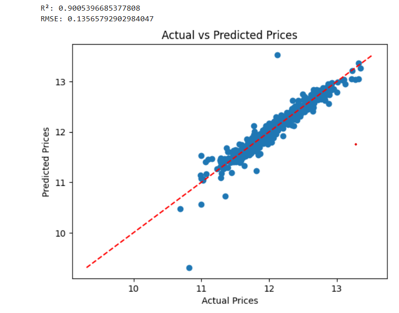

# 🏠 Ames Housing Price Prediction

This project uses **data cleaning** and **linear regression** techniques in python to predict house prices in Ames, Iowa, based on a dataset from Kaggle.

---

## 📁 Dataset

- **Source**: [Kaggle - House Prices: Advanced Regression Techniques](https://www.kaggle.com/competitions/house-prices-advanced-regression-techniques/data)
- **Target variable**: `SalePrice` (USD)
- **Features**: 80 explanatory (categorical + numerical) variables (excludes PID and Order #) 

---

## 🛠️ Tech Stack

- **Language**: Python3
- **Environment**: Jupyter Notebook or Virtual Environment (dependency list with versions included in dependencies.txt)

---

## 🧪 Workflow

### 1. **Data Preprocessing**
- Handle missing values
- Encode categorical features (One-Hot Encoding, Ordinal Mapping)
- Normalize/scale numerical features

### 2. **Exploratory Data Analysis**
- Visualized the distribution of sale prices
  
- Visualized feature relationships (e.g., `GrLivArea` vs. `SalePrice`)
  
- Removed outliers if needed

### 3. **Modeling**
- I trained the **Linear Regression** model using `scikit-learn`

### 4. **Evaluation**
- Evaluate using:
  - **R² score**
  - **Root Mean Squared Error (RMSE)**
- Plot **predicted vs. actual prices**



## 🚀 Getting Started

### 1. Clone the repo
```bash
git clone https://github.com/jackgerety/House-Price-Prediction-Ames-IA.git
cd House-Price-Prediction-Ames-IA
